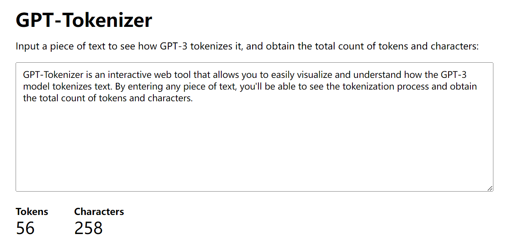

# GPT-Tokenizer

[GPT-Tokenizer](https://qqxufo.github.io/GPT-Tokenizer/index.html) is an interactive web tool that allows you to easily visualize and understand how the GPT-3 model tokenizes text. By entering any piece of text, you'll be able to see the tokenization process and obtain the total count of tokens and characters.

## Features

- Tokenize any input text using GPT-3's tokenization method
- Display tokens and character counts
- Visualize the tokenization process for a better understanding
- Easy-to-use web interface hosted on GitHub Pages

## Usage

Visit [GPT-Tokenizer](https://qqxufo.github.io/GPT-Tokenizer/index.html) to access and use the GPT-Tokenizer tool.

Simply input the desired text into the text box, and the tool will automatically display the tokenization results, including the total count of tokens and characters.
